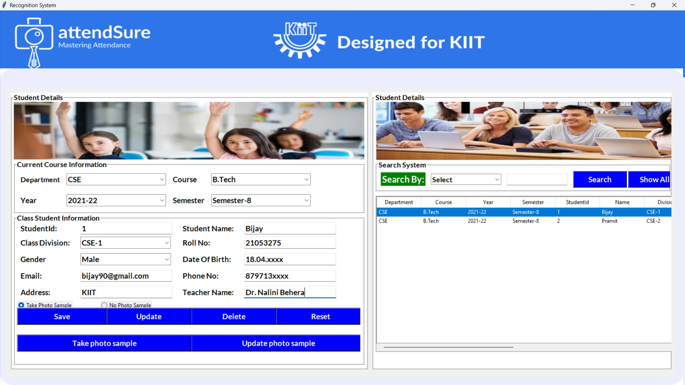
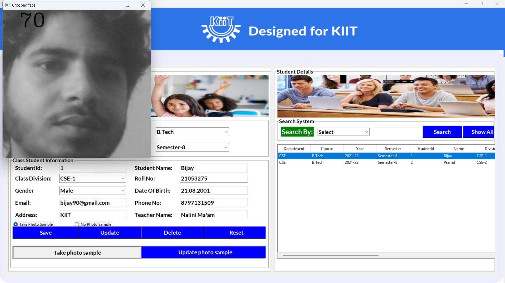
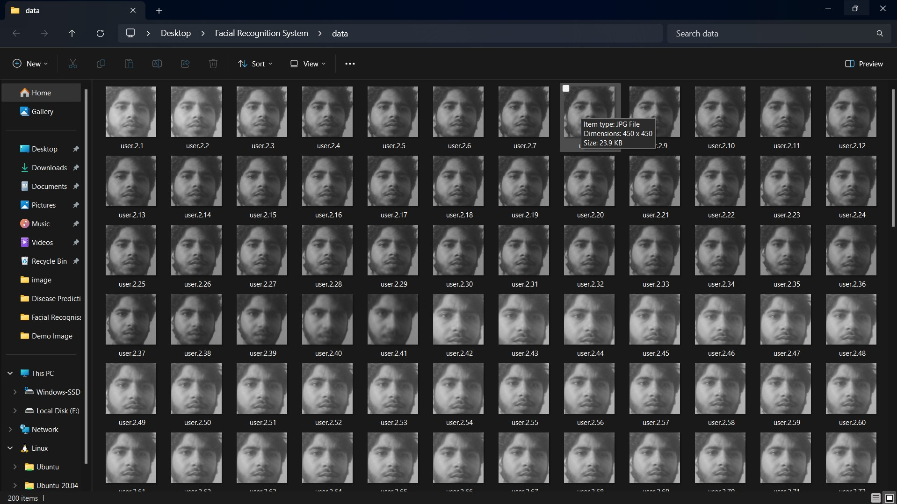
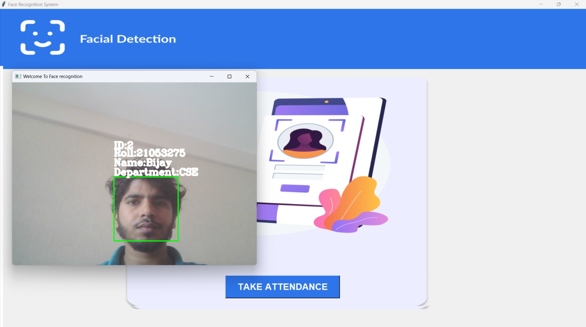
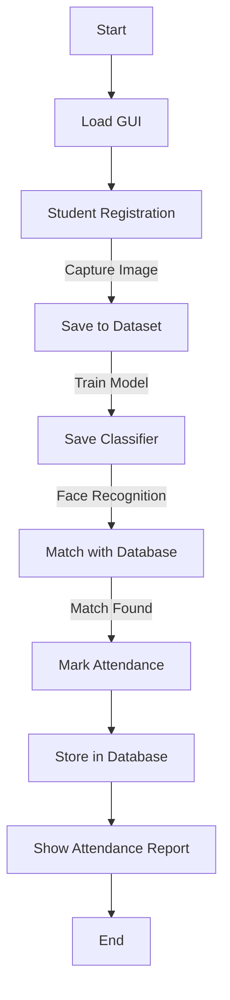

# Student Attendance Management System

## Project Overview
This project is a **Student Attendance Management System** developed using **Python, Machine Learning, OpenCV, and SQL**. It utilizes **Local Binary Pattern Histogram (LBPH)** for face recognition and **Haarcascade** for face detection. The GUI is built with **Tkinter**, and MySQL is used to manage the database.

## Technologies and Libraries Used
- **Python Version**: 3.10+
- **GUI Framework**: Tkinter
- **Image Processing**: OpenCV, PIL
- **Machine Learning Algorithm**: Local Binary Pattern Histogram (LBPH)
- **Face Detection**: Haarcascade Classifier
- **Database**: MySQL
- **Data Handling**: NumPy, OS
- **Alerts & Pop-ups**: Tkinter messagebox

## Features
- **Student Registration**: Add student details with images
- **Face Training**: Train the model with student images
- **Face Recognition**: Mark attendance by recognizing faces
- **Attendance Database**: Store and retrieve attendance records
- **GUI**: Interactive and user-friendly interface

---
For Demo checkout following link👇:  
<a href="https://bijayrauniyar-hello-doc.vercel.app/" target="_blank">AttenSure</a> </br>
### Images of Attensure: Student Attendance Management System:









## Step-by-Step Development Process

### Step 1: Set Up the Environment
Install the required libraries:
```sh
pip install opencv-python numpy pillow mysql-connector-python
```

### Step 2: Design the GUI with Tkinter
- Create a **main.py** file to manage the application.
- Use `Tkinter` to design buttons, labels, and images.
- Implement navigation between different windows.

### Step 3: Student Registration Module
- Create a **student.py** file.
- Take student input (name, ID, department, etc.).
- Capture images using OpenCV and store them in a **dataset** folder.

### Step 4: Train the Face Recognition Model
- Create a **train.py** file.
- Use `cv2.face.LBPHFaceRecognizer_create()` to train the model on student images.
- Save the trained model as `classifier.xml`.

### Step 5: Face Recognition for Attendance
- Create a **face_recognition.py** file.
- Load the trained model and recognize faces using OpenCV.
- Mark attendance if the face matches a student in the database.

### Step 6: Store Attendance Data in MySQL
- Create a table in MySQL to store student attendance.
- Use `mysql.connector` to interact with the database.
- Insert recognized students' data with timestamps.

### Step 7: Display Attendance
- Allow users to view attendance records.
- Implement search and filtering options.


---

## Flowchart


## Running the Project
1. Run `main.py` to launch the application.
2. Register students and capture images.
3. Train the model by clicking the "Train Data" button.
4. Use "Face Recognition" to mark attendance.
5. View attendance reports.

## Troubleshooting
- **ModuleNotFoundError: No module named 'PIL'**
  - Run: `pip install pillow`
- **AttributeError: module 'cv2.face' has no attribute 'LBPHFaceRecognizer_create'**
  - Install OpenCV Contrib: `pip install opencv-contrib-python`
- **Database Connection Issues**
  - Check MySQL credentials and ensure MySQL service is running.

## Conclusion
This project provides an efficient way to manage student attendance using face recognition. It integrates machine learning, image processing, and database management for an automated attendance system.
